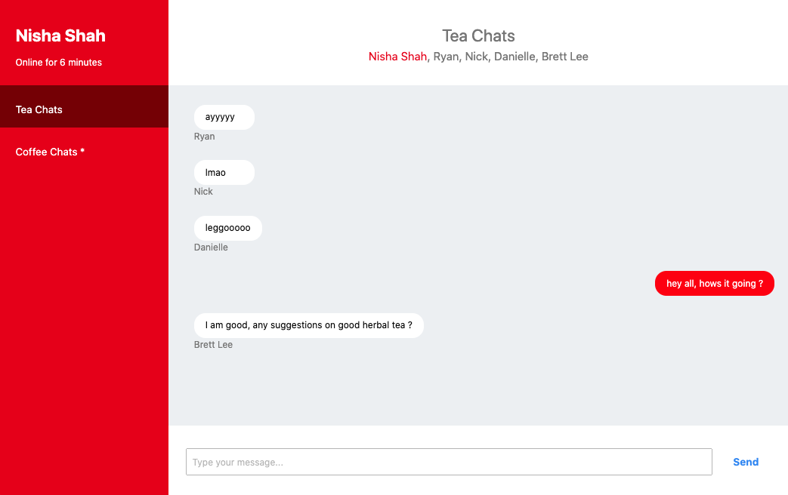

# Overview 
This is a chat application allowing multiple users to communicate in differnt chat rooms. 



# Main Features
1. Multiple users are able to chat in real time using websockets
2. Messages persisted by calling backend server APIs
3. Scrolls the chat window to the bottom when new messages are added
4. Left panel fixed width while right panel stretches to accommodate
5. Notification for new unread messages in another room
6. Users are added to a room after they post one message in that room

All details can be found in "details.pdf" in the same directory.


# How to build and run locally
Install Pre-requisites
* Node

```
# cd <Root Directory of project>
# Download Dependencies
npm install

# Open three new tabs in your favorite terminal

# Start HTTP Backend Server 
npm run api-server

# Start WebSocket Server
npm run websocket-server

# Build UI
npm start

# open localhost:3000 on your browser
# open multiple tabs in browser for multiple user communication
```

--------------------- Original Instructions --------------------
# Frontend chat app Project
* TLDR: *Build a chat app with real APIs*
* Time: *3hr - 6hrs*
* Allowed tools & frameworks: *anything*
* Show us what you got!

## Howdy! 👋  

This is the frontend interview project for DoorDash! We're going to ask you to build something with whatever tools you want, whatever language you want, or whatever.

If you want to keep it vanilla, that's fine—this should take you 2/3 hours with jQuery, plain ol' HTML and CSS. If you want to use other tools, (like Angular, React, Vue, Ember) that's fine too—*just make sure you have enough documentation for us to be able to build and run the app*. We just want you to build something that's maintainable, testable, and that you're proud of.

The goal here is not to demonstrate your pure coding ability—we're here to give you a problem that's not totally spec'd out for you, and we want to see far you can go. How good can you make it without much guidance? What are the sort of improvements and choices you'll make as you build this thing, and where do your priorities lie?

Remember, building stuff is supposed to be fun, so be creative! Happy coding!

## Getting started
There's a few things you need to get started on to get this to work.

### 1. Installing minimum deps
Make sure you have `node` installed, with a version greater than `7.0.0`. We highly recommend [`nvm`](https://github.com/creationix/nvm), or just installing the latest version of `node` with `brew install node` on macOS.

Once you have a good `node` installed, run `npm install` in this repo to get your dependencies.

### 2. Serving your app
By default, you can run `npm start` to run your app, serving the files from `/public`. You can, however, change this to whatever you want! Just make sure you document the changes somewhere so we can run this.

### 3. Running the api server
We have provided a simple api server for you. You can run `npm run api-server` to start it. Read the [spec](./spec/api-endpoints.md) for more details on the api.

### 4. Read the spec
There's a pretty fleshed out spec in the `./spec` directory. Checkout the [design specs here](./spec/designs/detailed-design-specs.md) to understand what you're building!

## What you can use to build
You can use literally _anything_ that can be served on the web. You should use what you're most comfortable with, no matter what (even if you heard that we use React). **We want you to use the tools you know, and we want to see you at your best and most productive.** 

Secondly, don't worry much about setting up build tools—use something simple and fast to spin up:
* If you're using Ember, it's fast to spin up something with [`ember-cli`](https://ember-cli.com/)
* If you're using Angular 1.x, you can use [this yeoman generator](https://github.com/yeoman/generator-angular) to spin up a scaffold
* If you're using Angular 2+, you can use [Angular CLI](https://cli.angular.io/) to create a new app scaffolding
* If you're using React, it's easy to use [`create-react-app`](https://github.com/facebookincubator/create-react-app) to start the project
* If you're using Vue, [`vue-cli`](https://github.com/vuejs/vue-cli) will be a fast way to get started.
* For anything else, use your favorite generators or templates!


## :
* Solid UX without strict guidance
* Chat Features
* Code quality
* Readability
* Testability
* Maintainability
* Communication 


## Extra notes

A couple of things to say:

1. Feel free to change the language you're writing this in. We want to see what good code looks like for you - feel free to add a `gulpfile`, setup `webpack`, or just use the plain JS, CSS, and HTML you're given. It's all up to you!

2. Feel free to use any libraries or frameworks you want, with the idea that they're increasing your productivity, not writing the app for you.

3. **Please don't** modify the server.js file.
